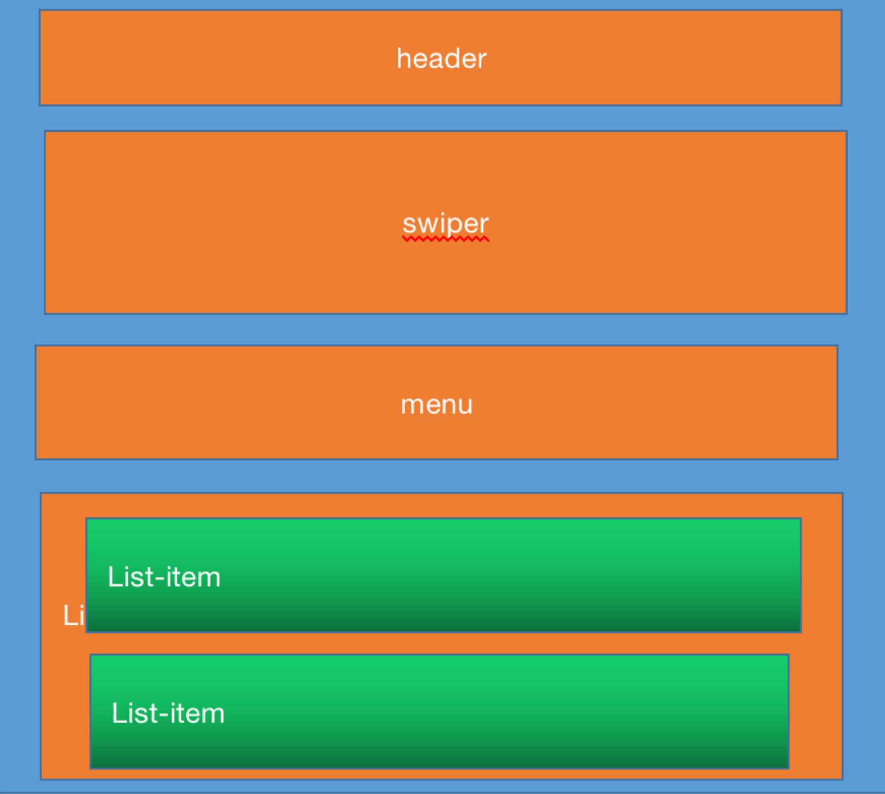
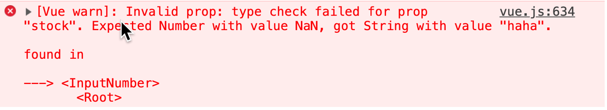
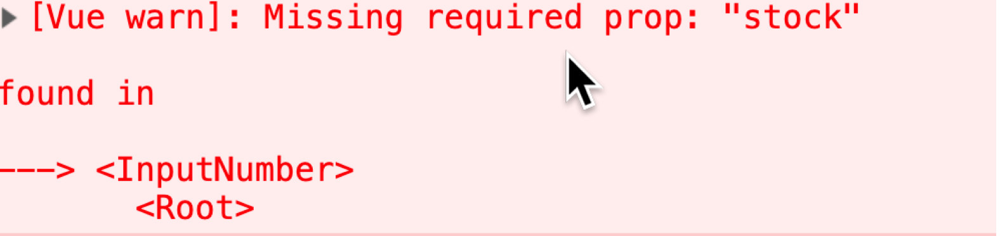
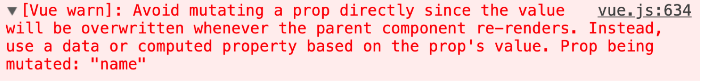
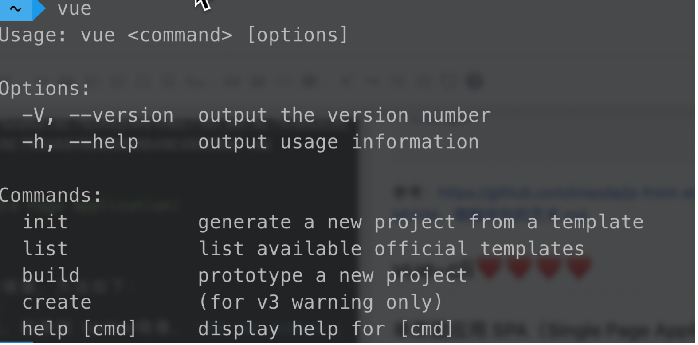
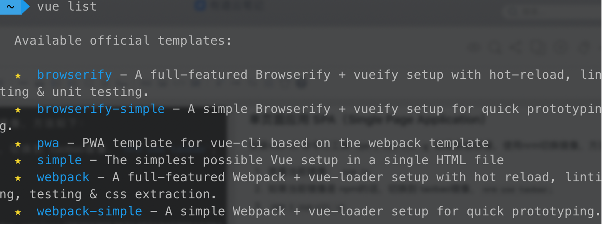
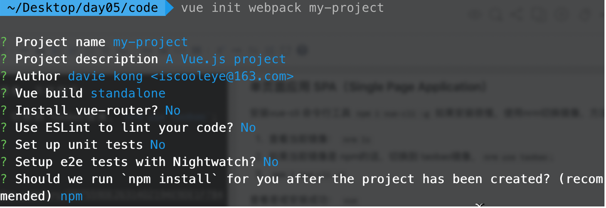
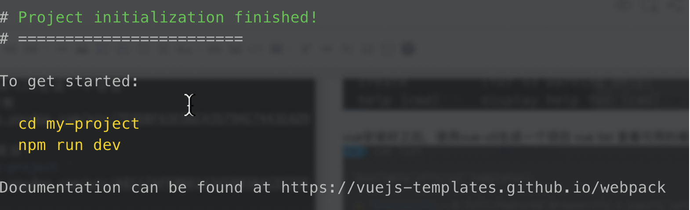
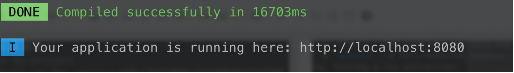
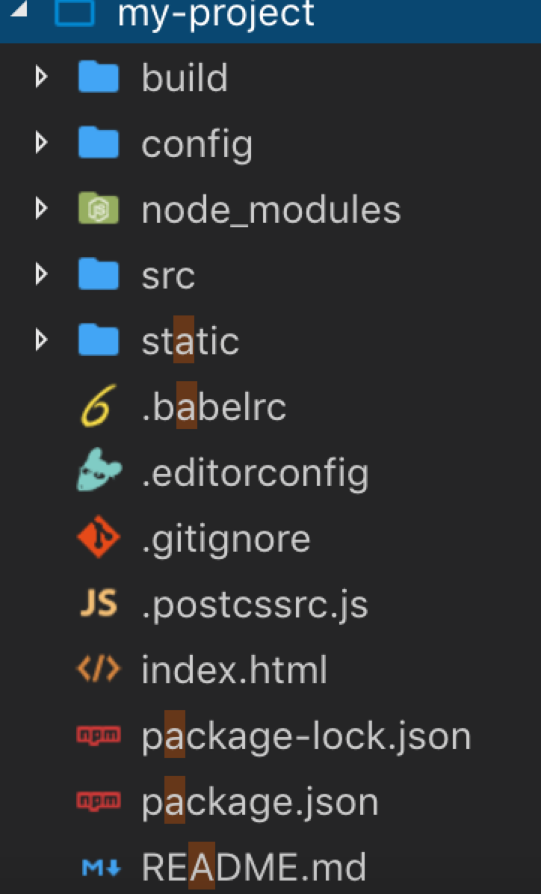

# Vuejs开发

❤️ 了解 

❤️❤️ 知道，能讲出来

❤️❤️❤️ 熟练使用 

❤️❤️❤️❤️ 非常熟练   

❤️❤️❤️❤️❤️ 非常重要，必须熟练使用，知道原理  

----
## 配置开发环境  day-1 ❤️❤️❤️
* 安装nrm 镜像管理工具
    * `npm install nrm -g` 安装nrm
    * `nrm ls` 查看有哪些镜像源
    * `nrm use taobao` 切换镜像源
    * `npm install express` 之后就可以使用npm正常安装依赖了
* 安装gitbash 命令行工具
    * 在电脑上任意位置右键，就可以看大 gitbash，点击弹出命令行工具
* 安装vscode编辑器
    * Beaytify格式化代码
    * Chinese  汉化
    * JavaScript (ES6) code snippets
    * Live Serve  从服务器打开html文件
    * Markdown PDF 把markdown 转成pdf格式的文件
    * Vetur  用来支持 vue

* 按vue-devtools 工具

## 工作规范❤️❤️❤️
* 自学BEM命名方式
* 自学OOCSS
* 注册邮箱
* 每周发工作周报
* ## 周报发送到：igame1987@163.com

## vue介绍
概念：是一套用于构建用户界面的渐进式JavaScript框架
开发者：尤雨溪  
github：https://github.com/yyx990803

## 前端发展史
### html
html [1990]----> html5 [2008.1.12]

### css❤️
css 1.0 1996
css 2.0 1998
css 3.0 2001

### EcmaScript❤️
1997年诞生
2015 EcmaScript 2015
2016 EcmaScript 2016 dart语言 vs javascript	（JavaScript胜出）

### MV*架构思想发展史❤️❤️
随着前端项目的逻辑越来越复杂和难以维护，那么前端这边引进了后端的架构思想（ MV* ）

* M Model 数据层
* V View 视图层
* VM ViewModel 视图模型（ 业务逻辑 VM 是 由 P 改名得来的）
* P Presenter 提出者（ Controller 改名得来的 ）
* C Controller 控制器 ( 业务逻辑 )


框架 1 | 架构思想 | 时间   
---|---|--- 
Backbone.js | MVP  | 2010.10
Angular.js( 1.0 ) | MVC  | 2010.10
Angular.ts ( 2.0 ) | MVC -> MVVM | 2016 目前已经更新到了 Angular8 ( 也属于angular2.0 版本 )
Vue 1.0 | MVVM | 2014/07
Vue 2.0	| MVVM	| 2016/09
React   | 2012	| 不太认可前端MVC这种架构思想， 你可以将React单纯看做是MVC中V


## Vuejs入门
* 声明式渲染 {{}}输出显示内容,内为一个js表达式
* v-bind 指令绑定属性
* 条件渲染 v-if 
* 循环 v-for
* v-model 双向绑定
* 组件化 Vue.component
----

##  Vuejs核心 day-2

优秀github仓库：https://github.com/vuejs/awesome-vue
js-front-end-practice：https://github.com/imaoda/js-front-end-practice
Nodejs:https://github.com/i5ting/How-to-learn-node-correctly
使用Nodejs+mongodb社区项目：https://github.com/cnodejs/nodeclub


#### Mustache 语法❤️❤️❤️
{{}}
合法的js表达式
四则运算、逻辑运算、比较运算、三元运算、方法调用
#### v-html 输出html
v-html输出 富文本  `<div></div>`
#### 在属性上绑定，使用v-bind
``

#### 模板语法支持所有的js表达式
#### v-bind 缩写 :title
``

#### v-on缩写 @click
@click  绑定事件句柄，事件函数
`<button  @click="eventHandle"> click</button>`

#### 计算属性❤️❤️❤️❤️
```
data:{
    num:100,
    arr:[
        {id:0,name:"zs",age:18},
        {id:1,name:"ls",age:36}
    ]
},
computed:{
    format(){
        return this.arr.filter( res => res.age > 20)
    }
}
```

#### 计算属性和方法的比较
计算属性 对计算结果缓存，依赖数据不变化，计算属性不会重新计算
方法反之
#### 侦听属性
watch:{
    arr(){
        console.log();
    }
}
#### class❤️❤️❤️
```
<div :class="{active:isActive,otherClass,....}"></div>
<div :class="classObj"></div>
```
```
data:{
  isActive:true  
},
computed:{
    classObj(){
        return {active:this.isActive}
    }
}

```
#### style❤️❤️❤️
```
<div :style="{width:w,backgroudColor:bgcolor}"></div>

<div :style="divStyles"></div>

<div :style="[divStyles,...]"></div>
```
```
data:{
    w:"100px",
    bgcolor:"red",
    divStyles:{
        
    }
}
```

#### 条件渲染❤️❤️❤️
- v-if  
    * true 添加DOM，false 移动DOM
- v-show
    * 始终渲染  display:none
    
- v-else-if=""

- v-else 


#### 列表渲染❤️❤️❤️

- v-for="item,i items"
- v-for="v,k,i  obj"
- :key="id"

#### 事件❤️❤️❤️
- v-on:click="click"
- @click="click(100,$event)"
- @click.prevent
- @keyup.enter

#### 表单❤️❤️❤️
- v-model
`<input  v-model="text" @keyup.enter="add" />`
```
data:{
    text:"",
    todos:[]
},
methods:{
    add(){
        this.todos.push(this.text)
    }
}
```

```
<select  v-model="sel">
    <option>A<option>
    <option>B<option>
    <option>C<option>
<select>
```


## 组件 day3
#### 定义组件❤️❤️❤️❤️
组件是可复用的 Vue 实例
  
使用Vue.component("my-header",{template:""})定义组件，第一个参数是组件名称。
组件名称的定义有两种方式：
* kebab-case `Vue.component('my-component-name', { /* ... */ })`
  使用 `<my-component-name>`
* PascalCase `Vue.component('MyComponentName', { /* ... */ })`
  使用：<MyComponentName> 或者<my-component-name>,但在DOM中使用只可以是：<my-component-name>

示例代码：
```
Vue.component('button-counter', {
  data: function () {
    return {
      count: 0
    }
  },
  template: '<button @:click="increase">点击了{{ count }} 次.</button>',
  methods:{
      increase(){
          this.count++
      }
  }
})
```
在页面上使用组件：

```
<button-counter></button-counter>
```
需要注意的是，data需要是一个函数，在函数内返回一个对象。这样的目的是为了使每一个组件都会返回一个对象的独立拷贝，否则的话，当一个组件的数据发送变化，可能会影响到其他组件。

#### props❤️❤️❤️❤️
prop是组件上的自定义特性，当一个值通过prop传递给一个组件的时候，他就变成了这个组件的属性。所有传入组件的prop都保存在props中。你可以像访问一个data一样访问prop。
示例代码：
```
Vue.component('bloger', {
        props:["title","content"],
        template: `
            <div class='bloger'>
                <div class='bloger-title'>{{title}}</div>
                <div class='bloger-content'>{{content}}</div>         
            </div>
        `
    })

    const app = new Vue({
        el:"#app",
        data:{
            blogs:[
                {id:0,title:"学习vue",content:"学习vue学习vue学习vue"},
                {id:1,title:"学习vue2",content:"学习vue学习vue学习vue2"},
                {id:2,title:"学习vue3",content:"学习vue学习vue学习vue3"},
            ]
        }
    })
```
然后在页面上使用组件：
```
<div class="main">
    <bloger v-for="b in blogs"
    :title="b.title"
    :content="b.content"
    :key="b.id"
    ></bloger>
</div>
```
props 也可以设置类型，规定传入传入子组件的prop类型：
```
props:{
    title:String,
    content:String
}
```
如果类型错误，报错：


数据的类型有：
- String
- Number
- Boolean
- Array
- Object
- Date
- Function
- Symbol
也可以使prop有多个类型
```
props:{
    propA:Number,
    propsB:[String,Number]
}
```
带有需求的验证：
```
props:{
    propA:Number,
    propB:[String,Number],
    propC:{
        type:Number, //类型
        required:true, //是否必须
        default:666 //默认值
    }
}
```
如果设置了 required:true，name当不传该值的时候就会报错：


props是==单向的数据==流，==从父组件传递到子组件，不应该在子组件内修改prop的值。
如果需要改变prop，可以将prop赋值给本地的一个data==
否则就会报错：

#### 从组件内向组件外传递事件
采用自定义事件的方式，可以实现从组件内部传递数据到组件外
示例代码：
在组件内，使用 this.$emit("事件名称",参数)来自定义事件
```
Vue.component('bloger', {
    props:["title","content"],
    template: `
        <div class='bloger'>
            <div class='bloger-title'>{{title}}</div>
            <div class='bloger-content'>{{content}}</div>
            <button @click="favor">点赞</button>           
        </div>
    `,
    methods: {
        favor(){
        //第一个参数是自定义事件名称，第二个参数是要传递出去的数据
            this.$emit("favor",1)
        }
    },
})
```
然后在使用组件的时候监听这个事件：
```
 <div class="main">
        <bloger v-for="b in blogs"
        :title="b.title"
        :content="b.content"
        :key="b.id"
        @favor="favorHandle"
        ></bloger>

        <h3>有{{favors}} 人喜欢</h3>
   </div>
```
接下来在Vue示例中，添加事件处理函数：
```
const app = new Vue({
    el:"#app",
    data:{
        blogs:[
            {id:0,title:"学习vue",content:"学习vue学习vue学习vue"},
            {id:1,title:"学习vue2",content:"学习vue学习vue学习vue2"},
            {id:2,title:"学习vue3",content:"学习vue学习vue学习vue3"},
        ],
        favors:0
    },
    methods:{
        favorHandle(arg){
        //接收到自定义事件传递来的参数
            this.favors += arg;
        }
    }
})
```
#### slot 插槽❤️❤️❤️
当需要在一个自定义的组件中插入其他的元素或者组件的时候，需要使用slot，插槽，来确定子元素或组件的位置：
定义组件，使用插槽：
```
Vue.component('my-article', {
    props:["title","content"],
    template: `
       <div>
            <h1>{{title}}</h1> 
            <slot> 备胎 </slot>
            <div>
                {{content}}
            </div>
       </div>
    `
})
```
在页面使用插槽：
```
<my-article :title="title" :content="content">
    <div> 插入的其他组件</div>
</my-article>
```
#### 具名插槽❤️❤️❤️
当有多个插槽的时候，可以给插槽命名：
```
 Vue.component('my-article', {
    props:["title","content"],
    template: `
       <div>
            <h1>{{title}}</h1> 
            <slot name="menu"> 备胎 </slot>
            <div>
                {{content}}
            </div>
            <slot name="footer"> 这里是footer </slot>
       </div>
    `
})
```
在使用插槽的时候，在<template>组件上使用v-slot指令（2.6版本后）
```
<my-article :title="title" :content="content">
    <template v-slot:menu>
        <div >  插入menu组件 </div>
    </template>
    <template v-slot:footer>
        <div >  插入footer组件 </div>
    </template>
</my-article>
```

## 生命周期❤️❤️❤️❤️
每个 Vue 实例在被创建时都要经过一系列的初始化过程——例如，需要设置数据监听、编译模板、将实例挂载到 DOM 并在数据变化时更新 DOM 等。同时在这个过程中也会运行一些叫做生命周期钩子的函数
在vue中有8个生命周期函数：
1. beforeCreate 对象初始化之前执行
2. created 对象初始化完成
3. beforeMount 组件渲染前执行
4. mounted 组件渲染完执行
5. beforeUpdate 数据已经更新，但是还未更新DOM
6. updated 数据已经更新，并且更新DOM
7. beforeDestroy 组件卸载前执行
8. destroyed 组件卸载后执行

示例代码：

```
 Vue.component("my-comp",{
    data:function(){
        return{
            num:0,
            musics:[]
        }
    },
    template:`
        <div>
            <div>{{num}}</div>
            <ul>
                <li v-for="m,i in musics" :key="i">
                    {{m.songname}} <audio  :src="m.src" controls></audio>
                </li>    
            </ul>
            <button @click='add'>click</button>    
        </div>
    `,
    methods: {
        add(){
            this.num++
        }
    },
    //对象初始化之前执行
    beforeCreate() {
        console.log('beforeCreate.....',this.num)
    },
    //对象初始化完成
    created() {
        console.log('created.....',this.num)
    },
    //组件渲染前执行
    beforeMount() {
        console.log('beforeMount.....',this.num)
    },
    //组件渲染完执行
    mounted() {
        console.log('mounted.....',this.num)
    },
    //数据已经更新，但是还未更新DOM
    beforeUpdate() {
        console.log('beforeUpdate.....',this.num)
    },
    //数据已经更新，并且更新DOM
    updated() {
        console.log('updated.....',this.num)
    },
     //组件卸载前执行
    beforeDestroy() {
        console.log('beforeDestroy.....')
    },
     //组件卸载后执行
    destroyed() {
        console.log('destroyed.....')
    },
})
const app = new Vue({
    el:"#app",
    data:{
        show:true
    }       
})
```
## 原生ajax
```
let url = "https://www.easy-mock.com/mock/5d1c66e9e85bc1461e567f67/api/music#!method=get"
//1/闯将xhr对象
let xhr = new XMLHttpRequest();
//2、建立连接，设置请求方式
xhr.open("GET",url);
//3、发送数据
xhr.send();
//绑定监听
xhr.onreadystatechange = function(){
    if(xhr.readyState == 4 && xhr.status == 200){
        let data = JSON.parse(xhr.responseText);
        console.log(data)
    }
}
```


## 使用promise 封装ajax❤️❤️❤️️
```
function ajax(url){
    return new Promise(function(resolve,reject){

        let xhr = new XMLHttpRequest();
        xhr.open("GET",url);
        xhr.send();
        xhr.onreadystatechange = function(){
            if(xhr.readyState == 4){
                if(xhr.status == 200){
                    // console.log(xhr.responseText)
                    resolve(xhr.responseText)
                }else{
                    reject(xhr.status)
                }
            }
        }

    })
}
```

## axios 数据请求 ❤️❤️️❤️️️
NPM：https://www.npmjs.com/package/axios
安装方式：
`npm install axios`
或者：
`<script src="https://unpkg.com/axios/dist/axios.min.js"></script>`
使用示例：
```
//get请求
axios.get('/user', {
    params: {
      ID: 12345
    }
})
.then(function (response) {
    console.log(response);
})
.catch(function (error) {
    console.log(error);
})
.then(function () {
    // always executed
}); 
```
```
//post请求
axios.post('/user', {
    firstName: 'Fred',
    lastName: 'Flintstone'
})
.then(function (response) {
    console.log(response);
})
.catch(function (error) {
    console.log(error);
});
```
一般，我们会在mounted生命周期函数内请求数据：
```
...省略代码...
mounted() {
    console.log('mounted.....',this.num)
    axios.get('https://www.easy-mock.com/mock/5d1c66e9e85bc1461e567f67/api/music#!method=get')
    .then(res =>{
        return res.data.data
    })
    .then(musics=>{
        console.log(musics)
        this.musics = musics;
    })
},
...省略代码...
```


## 注册组件❤️❤️❤️

使用JavaScript对象定义组件，
```
let buttonCounter = {
    data: function () {
        return {
        count: 0
        }
    },
    template: '<button @click="increase">点击了{{ count }} 次.</button>',
    methods:{
        increase(){
            console.log('click..')
            this.count++
        }
    }
}
```
然后在 components 选项中定义你想要使用的组件：
```
const app = new Vue({
    el:"#app",
    components:{buttonCounter}
})
```


## Mixins❤️❤️
组件有相同的部分，可以单独定义出来，以mixins的方式引入
定义mixins：
```
let mix = {
    data: function () {
        return {
            count: 0
        }
    },
    methods:{
        increase(){
            console.log('click..')
            this.count++
        }
    }
}
```
使用mixins:
```
let buttonCounter = {
    mixins:[mix],
    template: '<button @click="increase">点击了{{ count }} 次.</button>',
}

let buttonCounter2 = {
    mixins:[mix],
    template: `
        <div>
            <h2>{{counter}}</h2>
            <button @click="increase">点击了{{ count }} 次.</button>    
        </div>
    `,
    computed: {
        counter(){
            return this.count+3;
        }
    },
}
```

## 封装swiper❤️❤️❤️
```

Vue.component("mySwiper",{
    template:`
    <div class="swiper-container">
        <div class="swiper-wrapper">
            <div class="swiper-slide">Slide 1</div>
            <div class="swiper-slide">Slide 2</div>
            <div class="swiper-slide">Slide 3</div>
        </div>
        <!-- Add Arrows -->
        <div class="swiper-button-next"></div>
        <div class="swiper-button-prev"></div>
    </div>
    `,
    mounted() {
        var swiper = new Swiper('.swiper-container', {
            navigation: {
                nextEl: '.swiper-button-next',
                prevEl: '.swiper-button-prev',
            },
        });
    },
})
```
使用封装的swiper组件
```
<div id="app">
    <my-swiper></my-swiper>  
</div>
```

## 响应式原理❤️❤️❤️❤️
```
<div id="app">
    <h1 id="show"></h1>
    <input type="text" id="input">
</div>
<script>
let obj={};
// 通过defineProperty 来给一个对象添加属性
Object.defineProperty(obj, 'name', {
  // set 会在设置对象属性值的时候触发
    set(v){
        console.log('setter',v)
        //调用render方法，更新DOM
        render(v)
    },
    get(){
        console.log('gettter')
    }
});
document.getElementById("input")
.addEventListener("keyup",function(){
    console.log('sss:',this.value)
    obj.name = this.value
},false)
//更新DOM
function render(value){
    document.querySelector("#show").innerHTML = value;
}

</script>
```
## 50行代码实现MVVM❤️❤️❤️
```
<!DOCTYPE html>
<html lang="en">
<head>
  <meta charset="UTF-8">
  <meta name="viewport" content="width=device-width, initial-scale=1.0">
</head>
<body>
    <div id='app'>
        <h3>姓名</h3>
        <p>{{name}}</p>
        <h3>年龄</h3>
        <p>{{age}}</p>
    </div>
</body>
</html>
<script>
document.addEventListener('DOMContentLoaded', function(){
    let opt = {el:'#app', data:{name:'检索中...', age:30}}
    let vm = new Vue(opt)
    setTimeout(() => {
        opt.data.name = '钢铁侠'
    }, 2000);
}, false)
class Vue{
    constructor(opt){
        this.opt = opt
        this.observe(opt.data)
        let root = document.querySelector(opt.el)
        this.compile(root)
    }
    // 为响应式对象 data 里的每一个 key 绑定一个观察者对象
    observe(data){ 
        Object.keys(data).forEach(key => {
            let obv = new Observer() 
            data["_"+key] = data[key]
            // 通过 getter setter 暴露 for 循环中作用域下的 obv，闭包产生
            Object.defineProperty(data, key, {
                get(){
                    Observer.target && obv.addSubNode(Observer.target);
                    return data['_'+key]
                }, 
                set(newVal){
                    obv.update(newVal)
                    data['_'+key] = newVal
                }
            })
        })
    }
    // 初始化页面，遍历 DOM，收集每一个key变化时，随之调整的位置，以观察者方法存放起来    
    compile(node){
        [].forEach.call(node.childNodes, child =>{
            if(!child.firstElementChild && /\{\{(.*)\}\}/.test(child.innerHTML)){
                let key = RegExp.$1.trim()
                child.innerHTML = child.innerHTML.replace(new RegExp('\\{\\{\\s*'+ key +'\\s*\\}\\}', 'gm'),this.opt.data[key]) 
                Observer.target = child
                this.opt.data[key] 
                Observer.target = null
            }
            else if (child.firstElementChild) 
            this.compile(child)
        })
    }    
}
// 常规观察者类
class Observer{
    constructor(){
        this.subNode = []    
    }
    addSubNode(node){
        this.subNode.push(node)
    }
    update(newVal){
        this.subNode.forEach(node=>{
            node.innerHTML = newVal
        })
    }
}
</script>

```
参考：https://github.com/imaoda/js-front-end-practice/blob/master/50%E8%A1%8C%E4%BB%A3%E7%A0%81%E7%9A%84MVVM%EF%BC%8C%E7%90%86%E8%A7%A3%E9%97%AD%E5%8C%85%E7%9A%84%E8%89%BA%E6%9C%AF.md
## vue-cli❤️❤️❤️❤️

#### 单页面应用 SPA（Single Page Application）

安装vue-cli 命令行工具
`npm i vue-cli -g `
如果安装很慢，使用nrm切换镜像，方法如下：
1. 查看当前镜像： `nrm ls`
2. 如果当前镜像是 npm的话，切换到 taobao镜像，`nrm use taobao`;
3. `npm i vue-cli -g`

 查看是或安装成功：
 `vue`
 


vue安装好之后，使用vue-cli生成一个项目
vue list 查看可用的模板

使用 webpack模板创建项目：
` vue init webpack my-project `

项目创建成功之后，界面如下：


启动项目：
1. `cd my-project` 进入到项目目录
2. `npm run dev`  启动项目

然后打开浏览器，在地址栏输入： http://localhost:8080 回车
 
##### 使用vscode导入项目，查看目录结构


* index.html  单页面的那个html页面文件
* /static 静态文件目录
* /config 项目的配置文件
* /build  webpack的配置文件
* /src 开发目录
    * /assets 一些资源文件
    * /components 组件目录
    * App.vue 单文件组件,项目的根组件
    * main.js  项目的入口文件


#### 初步使用vue-cli

1. 安装 axiox  `npm install axios --save`
2. 重新启动项目 `npm run dev` 或者 `npm start`
