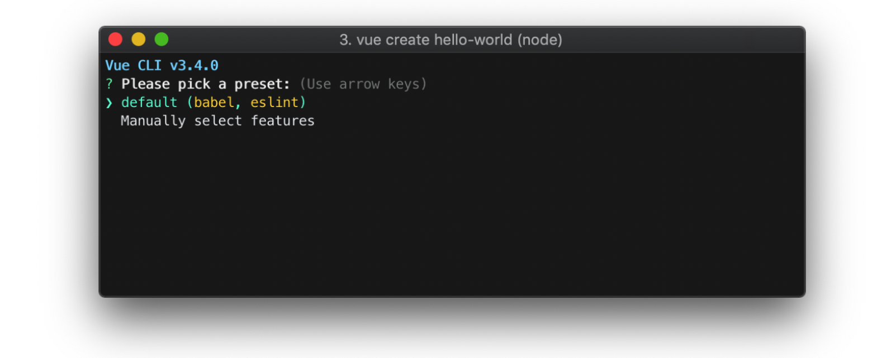
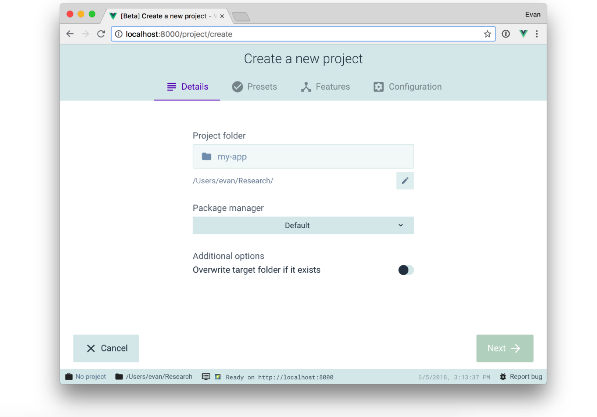
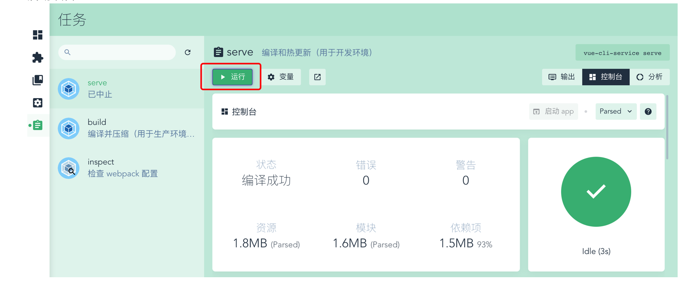
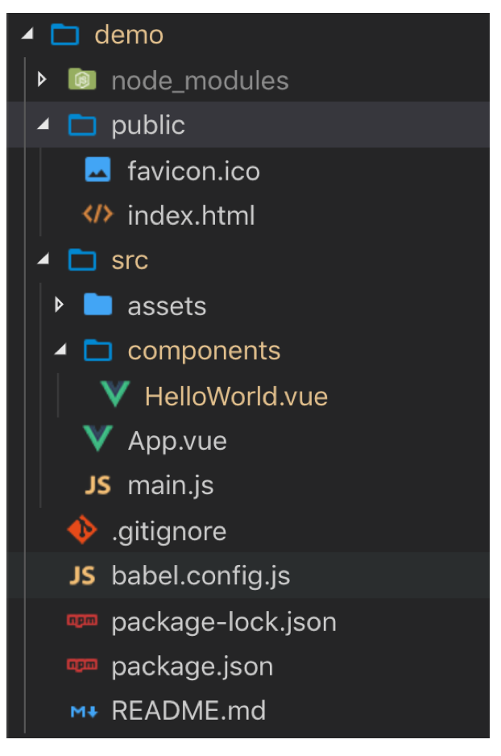

## 1. 使用vue-cli 3.x 💎💎💎
1. 安装vue脚手架3.x版本
`npm install -g @vue/cli`
2. 查看版本：`vue --version`
3. 创建项目：`vue create hello-world`
   
    这个默认的设置非常适合快速创建一个新项目的原型，而手动设置则提供了更多的选项，它们是面向生产的项目更加需要的。
4. 安装依赖和启动
    * `npm install` 安装依赖
    * `npm run serve` 启动项目，构建开发坏境
    * `npm run build` 构建生产环境
5. 使用图形化界面
    
6. 启动项目
  

## 目录结构解析 💎💎💎
使用vue-cli 3.0创建好的项目目录结构如下：


## 3. 了解webpack 😈😈
webpack 是一个现代 JavaScript 应用程序的静态模块打包器(module bundler)。当 webpack 处理应用程序时，它会递归地构建一个依赖关系图(dependency graph)，其中包含应用程序需要的每个模块，然后将所有这些模块打包成一个或多个 bundle

1. webpack中文官网：https://www.webpackjs.com/
2. webpack核心概念：
    - 入口(entry)
    - 输出(output)
    - loader
    - 插件(plugins)

## 4. Vue.config.js 配置 😈😈😈😈
1. vue.config.js    
    vue.config.js 是一个可选的配置文件，如果项目的 (和 package.json 同级的) 根目录中存在这个文件，那么它会自动加载。你也可以使用 package.json 中的 vue 字段，但是注意这种写法需要你严格遵照 JSON 的格式来写。

    这个文件应该导出一个包含了选项的对象：
    ```
    // vue.config.js
    module.exports = {
      // 选项...
    }
    ```
2. 一个 vue.config.js 配置示例：
```
let path = require('path');

module.exports = {
    devServer: {
      proxy: {
        '/ajax': {
          target: 'http://m.maoyan.com',
          changeOrigin: true  //代理服务器会在请求头中加入相应Host首部，然后目标服务器就可以根据这个首部来区别要访问的站点了
        },
        '/api': {
          target: 'http://m.maoyan.com/ajax/',
          changeOrigin: true,
          ws: true,
          pathRewrite: {//如果改变了api 路径，可以加上这个配置，重写路径
            '^/api': ''
          },
          secure:false // 可以访问https服务器
        },
        '/foo': {
          target: '<other_url>'
        },
      }
    },
    configureWebpack:{
      resolve:{
        alias:{
          '@':path.resolve(__dirname,'src/')
        }
      }
    },
    publicPath:"./", //相对路径
  
    //多页面开发
    pages: {
        index: {
          // page 的入口,必填
          entry: 'src/main.js',
          // 模板来源
          template: 'public/index.html',
          // 在 dist/index.html 的输出
          filename: 'index.html',
          // 当使用 title 选项时，
          // template 中的 title 标签需要是 <title><%= htmlWebpackPlugin.options.title %></title>
          title: 'Index Page',
          // 在这个页面中包含的块，默认情况下会包含
          // 提取出来的通用 chunk 和 vendor chunk。
          chunks: ['chunk-vendors', 'chunk-common', 'index']
        },
        davie: 'src/davie.js'
      }
  }
```
3. proxy代理    
    如果你的前端应用和后端 API 服务器没有运行在同一个主机上，你需要在开发环境下将 API 请求代理到 API 服务器。这个问题可以通过 vue.config.js 中的 devServer.proxy 选项来配置。例如：
    ```
    module.exports = {
      devServer: {
        proxy: {
         '/ajax': {
              target: 'http://m.maoyan.com', // 要请求的目标服务器
              changeOrigin: false //代理服务器会在请求头中加入相应Host首部，然后目标服务器就可以根据这个首部来区别要访问的站点了
            },
          '/api': {
              target: 'http://m.maoyan.com/ajax/',
              changeOrigin: true,
              ws: true,
              pathRewrite: { //如果改变了api 路径，可以加上这个配置，重写路径
                '^/api': ''
              },
              secure:false // 可以访问https服务器
            }
        }
      }
    }
    ```


4. alias别名    
  vue 默认把 /src 的别名设置为 @，例如：    
    `import HelloWorld from './components/HelloWorld.vue'`  
    可以写为：  
    `import Movies from '@/components/HelloWorld'`
    在node_modules/@vue/cli-service/lib/config/base.js 这里面
    可以看到别名的设置：`.set('@', api.resolve('src'))`
    修改配置可以在 vue.config.js 中添加：
    ```
    configureWebpack:{
      resolve:{
        alias:{
          '@':path.resolve(__dirname,'src/')
        }
      }
    },
    ```
    
5. 配置 publicPath: './'    
    默认情况下，Vue CLI 会假设你的应用是被部署在一个域名的根路径上，例如 `https://www.my-app.com/`。如果应用被部署在一个子路径上，你就需要用这个选项指定这个子路径。例如，如果你的应用被部署在 `https://www.my-app.com/my-app/`，则设置 publicPath 为 /my-app/。

    这个值也可以被设置为空字符串 ('') 或是相对路径 ('./')，这样所有的资源都会被链接为相对路径，这样打出来的包可以被部署在任意路径。  
    示例,在vue.config.js中添加：  
    `publicPath:"./",` //相对路径
`
6. MPA(多页面)应用的配置

在 multi-page (多页面)模式下构建应用。每个“page”应该有一个对应的 JavaScript 入口文件。其值应该是一个对象，对象的 key 是入口的名字，value 是：

* 一个指定了 entry, template, filename, title 和 chunks 的对象 (除了 entry 之外都是可选的)；
* 或一个指定其 entry 的字符串。

```
module.exports = {
  pages: {
    index: {
      // page 的入口
      entry: 'src/index/main.js',
      // 模板来源
      template: 'public/index.html',
      // 在 dist/index.html 的输出
      filename: 'index.html',
      // 当使用 title 选项时，
      // template 中的 title 标签需要是 <title><%= htmlWebpackPlugin.options.title %></title>
      title: 'Index Page',
      // 在这个页面中包含的块，默认情况下会包含
      // 提取出来的通用 chunk 和 vendor chunk。
      chunks: ['chunk-vendors', 'chunk-common', 'index']
    },
    // 当使用只有入口的字符串格式时，
    // 模板会被推导为 `public/subpage.html`
    // 并且如果找不到的话，就回退到 `public/index.html`。
    // 输出文件名会被推导为 `subpage.html`。
    subpage: 'src/subpage/main.js'
  }
}
```

    
7. Json-server实现mock数据  
Github:https://github.com/typicode/json-server  
json-server 是一个用来搭建json数据服务器的工具。

### RestFul API:https://www.runoob.com/w3cnote/restful-architecture.html


数据库： user
```
//添加用户
app.get('/addUser',function(req,res){
    
})
//查找
app.get('/getUser',function(req,res){
    
})
//更新用户
app.get('/updateUser',function(req,res){
    
})
//删除用户
app.get('/delUser',function(req,res){
    
})
```

url: http://www.1903.com/addUser


restful api:
url:http://www.1903.com/user
```
//添加用户
app.post('/user',function(req,res){
    
})
//查找
app.get('/user',function(req,res){
    
})
//更新用户
app.put('/user',function(req,res){
    
})
//删除用户
app.delete('/user',function(req,res){
    
})

```


#### json-server的使用方法：
    1. 安装：`npm install -g json-server`
    2.创建json数据，创建db.json 
    {
        "posts": [
          { "id": 1, "title": "json-server", "author": "typicode" },
          { "id": 2, "title": "json-server2", "author": "typicode" },
          { "id": 3, "title": "json-server3", "author": "typicode" },
          { "id": 4, "title": "json-server4", "author": "typicode" },
          { "id": 5, "title": "json-server5", "author": "typicode" }
        ],
        "comments": [
          { "id": 1, "body": "some comment1", "postId": 1 },
          { "id": 2, "body": "some comment2", "postId": 2 },
          { "id": 3, "body": "some comment3", "postId": 3 }
        ],
        "profile": { "name": "typicode" }
      }
    3.  启动json服务器
        json-server  --watch db.json
    4. 访问：http://localhost:3000/comments/2 获取comments的id为2的数据
    5. query参数：`http://localhost:3000/posts?title=json-server2`
    6. 分页：http://localhost:3000/posts?_page=2&_limit=2
    7. 排序：http://localhost:3000/posts?_sort=id&_order=desc （desc:降序，asc升序）
    8. 截取：http://localhost:3000/posts?_start=3&_end=5 
    9. 条件查询：http://localhost:3000/posts?id_gte=3


## 5. ✍ 学员使用vue-cli练习，开发totdolist️

## 6. 移动端布局与适配 💎💎💎💎

#### 1. 什么是像素？    
    像素，又称画素，是图像显示的基本单位，译自英文“pixel”，pix是英语单词picture的常用简写，加上英语单词“元素”element，就得到pixel，故“像素”表示“图像元素”之意，有时亦被称为pel(picture element) 

像素分为两种：设备像素和CSS像素  
　　　　1、设备像素(device independent pixels): 设备屏幕的物理像素，任何设备的物理像素的数量都是固定的  
　　　　2、CSS像素(CSS pixels): 又称为逻辑像素，是为web开发者创造的，在CSS和javascript中使用的一个抽象的层，我们平常使用的都是css像素


#### 2. DPR
    设备像素比DPR(devicePixelRatio)是默认缩放为100%的情况下，设备像素和CSS像素的比值 
    
    DPR = 设备像素 / CSS像素(某一方向上)

#### 3. viewport
viewport 是用户网页的可视区域
在移动开发中，一般会把viewport的宽度设置为设备的宽度
在head标签中添加：
```
<meta name="viewport" content="width=device-width,minimum-scale=1.0,maximum-scale=1.0,user-scalable=no"/>
```
* width：控制 viewport 的大小，可以指定的一个值，如 600，或者特殊的值，如 device-width 为设备的宽度（单位为缩放为 100% 时的 CSS 的像素）。
* height：和 width 相对应，指定高度。
* initial-scale：初始缩放比例，也即是当页面第一次 load 的时候缩放比例。
* maximum-scale：允许用户缩放到的最大比例。
* minimum-scale：允许用户缩放到的最小比例。
* user-scalable：用户是否可以手动缩放。
示例代码：
```
<!DOCTYPE html>
<html lang="en">
<head>
    <meta charset="UTF-8">
    <meta name="viewport" content="width=device-width, initial-scale=1.0">
    <meta http-equiv="X-UA-Compatible" content="ie=edge">
    <title>Document</title>
    <style>
    img{
        width: 400px;
        max-width: 100%;
    }
    </style>
</head>
<body>
    <h1>hello world</h1>
    
</body>
</html>
```
如果不设置viewport，实际视口（viewport）会比屏幕宽度大，会出现左右滑动现象。

#### 4. rem布局

##### 自适应布局和响应式布局：

* 响应式设计表示在不同的屏幕尺寸下,都有良好的布局和内容表现,简单一点的说,就是一个页面可以适配多种不同尺寸的屏幕,而且看上去还是设计良好的。
    为了实现这个目的,可能会利用js或者css去动态改变布局的尺寸,在这个过程中会伴随元素尺寸的改变,布局的改变,甚至会把元素隐藏,比如在pc端显示的页面转到移动端就会这样
    
* 自适应往往考虑的是另一个方面,就是希望页面的设计与设计稿的设计比例一致,这个也是做自适应的目的,在这个过程中针对不同的屏幕宽度元素的尺寸也会改变,但是一般不会有布局改变,和元素的隐藏

##### rem
rem作用于非根元素时，相对于根元素字体大小；rem作用于根元素字体大小时，相对于其出初始字体大小。  
由于rem是一种相对单位，我们设置了根元素的font-size，内部的元素使用rem设置大小，就都会是相对于根元素的大小。如果在根据设备大小，动态设置根元素的font-size，就实现了页面的自适应。
示例代码：
```
function setrem(){
    //设置根元素font-size为设备宽度的 1/10
    document.documentElement.style.fontSize = document.documentElement.clientWidth / 10 + 'px';
}
//窗口大小发生变化时，重置
window.onresize = function(){
    setrem()
}
setrem()
```

#### 5. 1px边框问题
为什么移动端css里面写了1px, 实际看起来比1px粗?
由于DPR的原因，设置的1px，在手机上显示可能是2px或者3px，解决办法：

在devicePixelRatio = 2 时，输出viewport:
``` 
<metaname="viewport"content="initial‐scale=0.5,maximum‐scale=0.5,mini
mum‐scale=0.5, user‐scalable=no">
```
在devicePixelRatio = 3 时，输出viewport:
```
<metaname="viewport"content="initial‐scale=0.3333333333333333,maximum‐ scale=0.3333333333333333, minimum‐scale=0.3333333333333333, user‐scalable=n o">
```
参考：https://www.cnblogs.com/lunarorbitx/p/5287309.html

##### [淘宝手淘flexble](https://github.com/cooleye/flexible) 


## 7. 移动端事件 💎💎💎

#### 1. click事件300ms延迟
早先，苹果公司，为了用户在手机上查看网页，需要放大页面，于是采用了双击来放大页面。为了区分单击和双击，浏览器会延迟300毫秒，来判断用户是单击还是双击。后来苹果沿用了这样的设计，安卓也借鉴了这样的设计。于是就有了300ms的演示。
参考：https://www.cnblogs.com/chengxs/p/11064469.html
##### FastClick
`npm install fastclick -S`

github:https://github.com/ftlabs/fastclick


#### 2. Zepto.js


#### 3. Hammer.js

* FEhelpter  
* 草料二维码

